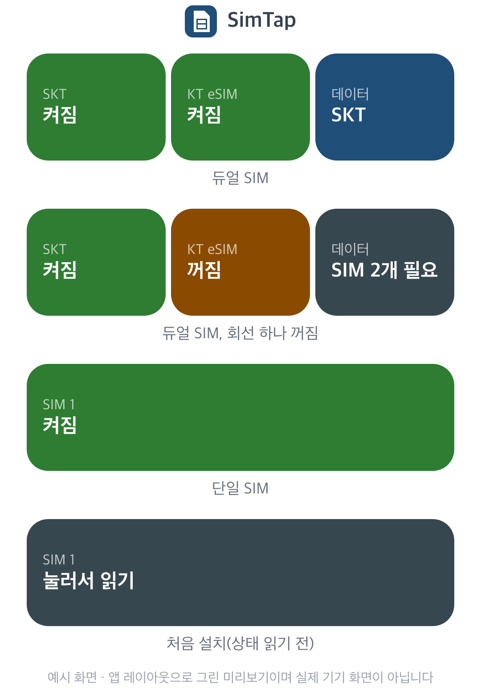

# SimTap

[English](README.md) · **한국어**

**갤럭시 SIM 관리자의 회선 스위치를 홈 화면 위젯 한 번으로 켜고 끕니다.**

업무 회선을 퇴근 뒤 끄거나 여행용 eSIM 을 필요할 때만 켜려면 설정 > 연결 > SIM 관리자까지 들어가야 합니다. SimTap 은 그 스위치를 4x1 위젯에 모아 지금 켜져 있는지 꺼져 있는지 보여 주고 한 번에 바꿉니다.

## 할 수 있는 것

- **회선 칸 두 개.** SIM 관리자 첫 화면의 회선을 위에서부터 두 개까지 SIM 이름으로 보입니다. 유심과 eSIM 모두 됩니다.
- **데이터 칸.** 지금 모바일 데이터에 쓰는 SIM 을 보이고 누르면 「모바일 데이터」 선택 화면을 엽니다. 듀얼 SIM 기기에서 보입니다. 켜진 SIM 이 2개 미만이면 흐리게 「SIM 2개 필요」로 표시합니다.
- **일반 확인 창은 자동으로 확인합니다.** 위젯에서 칸을 누른 것이 켜기·끄기 의사이므로 누른 SIM 이름이 제목에 있는 확인 창을 한 번 누릅니다. 끄기 창은 본문과 관계없이 누릅니다. 데이터 SIM 이 다른 SIM 으로 넘어간다는 안내, 마지막 SIM 을 끈다는 경고, MMS 를 주고받는 중이라는 경고가 있어도 마찬가지입니다.
- **위험한 창은 직접 누르셔야 합니다.** 다른 SIM 을 함께 끄는 켜기 창이나 eSIM 보안 경고처럼 설명 문장이 있는 켜기 창, 버튼이 셋인 창, eSIM 초기화 화면은 SimTap 이 누르지 않습니다.
- **끝나면 홈으로 돌아옵니다.** 확인을 누른 뒤에는 eSIM 처럼 오래 걸려도 끝날 때까지(최대 3분) 기다립니다.
- **빗나가면 멈춥니다.** 위젯에 보이던 SIM 이름과 같은 스위치가 없으면 아무것도 누르지 않고 알려 줍니다.

## 설치

1. 보안 위험 자동 차단(설정 > 보안 및 개인정보 보호)과 Play 프로텍트의 「앱 검사」를 잠깐 끕니다. 켜져 있으면 설치가 막힙니다. 설치 뒤 다시 켜도 됩니다.
2. [Releases](https://github.com/tapbros/simtap/releases/latest) 에서 APK 를 받아 설치합니다.
3. SimTap 을 열고 「접근성 설정 열기」에서 SimTap 을 켭니다. 흐리게 보여 켤 수 없으면 앱 정보 > ⋮ > 제한된 설정 허용을 먼저 누릅니다. ⋮ 메뉴에 그 항목이 없으면 접근성에서 SimTap 을 한 번 켜 보면 생깁니다.
4. 홈 화면 빈 곳을 길게 누르고 위젯 > SimTap 을 원하는 자리에 놓습니다.
5. 「상태 읽어 오기」를 누르거나 위젯의 「눌러서 읽기」 칸을 누르면 SIM 이름과 상태가 나타납니다.

업데이트는 새 APK 를 덮어 설치하면 됩니다. 위젯과 설정은 그대로 남습니다.

## 어떻게 동작하나요

일반 앱은 SIM 을 켜고 끌 권한이 없습니다(시스템 권한 `MODIFY_PHONE_STATE`). 그래서 SimTap 은 위젯을 누르면 SIM 관리자 화면을 열고 접근성 서비스가 그 화면의 스위치를 대신 누릅니다. 사람이 직접 누르는 것과 같은 길이라 One UI 가 띄우는 확인 창도 그대로 뜹니다.

## 보안

- 요청 권한 0개, 인터넷 권한 없음.
- 접근성 서비스는 SIM 관리자 앱 하나(`com.samsung.android.app.telephonyui`)의 화면만 봅니다.
- 위젯을 누른 뒤에만 스위치를 누릅니다. 그냥 SIM 관리자를 열면 SIM 이름과 상태만 기억하고 아무것도 누르지 않습니다.

## 확인한 기기와 한계

- 갤럭시 Z 폴드8, One UI 9.0 (유심 1개)에서 접힘·펼침 화면 모두 시험했습니다.
- 듀얼 SIM(유심+eSIM, eSIM 여러 개, 유심 두 장)은 SIM 관리자 화면을 흉내 낸 시험 앱으로 확인했습니다. 실제 듀얼 SIM 기기에서 안 되면 기종과 One UI 버전을 알려 주세요.
- 회선 칸은 두 개까지입니다. eSIM 프로필이 셋 이상이면 화면 위쪽 두 개만 보입니다.
- 데이터 칸은 시스템 언어가 한국어나 영어일 때만 찾습니다.

SimTap 은 [ShieldTap](https://github.com/tapbros/shieldtap) 의 형제 앱입니다. 개인이 만든 비공식 앱이며 삼성전자와 관계가 없습니다.

## 라이선스

Apache License 2.0. [LICENSE](LICENSE), [NOTICE](NOTICE) 를 보세요.

© 2026 tapbros
