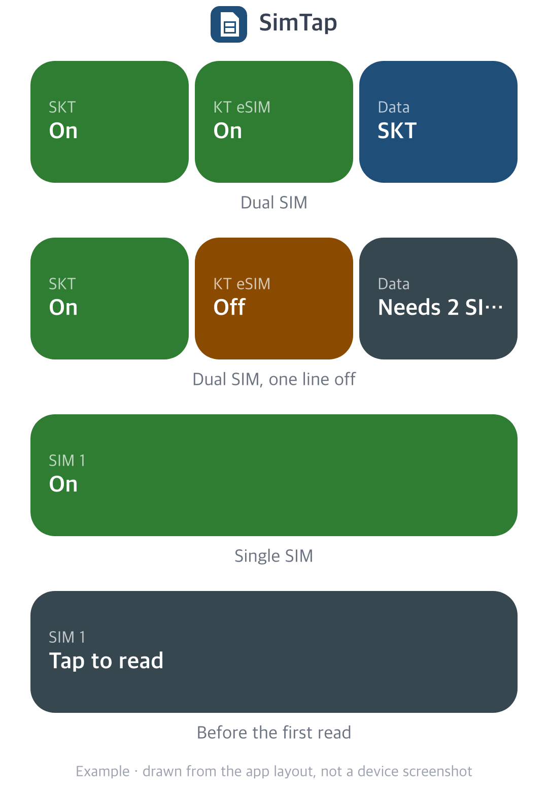

# SimTap

**English** · [한국어](README.ko.md)

**Turn SIM lines on or off from the Samsung Galaxy home screen with one tap.**

Turning off a work line after hours or a travel eSIM between trips means going to Settings > Connections > SIM manager every time. SimTap puts those switches in a 4x1 widget that shows whether each line is on or off and switches it with one tap.

## What it does

- **Two line cells.** Shows up to two lines from the top of the SIM manager by their SIM names. Physical SIMs and eSIMs both work.
- **Data cell.** Shows the SIM used for mobile data and opens the Mobile data picker. It appears on a dual SIM phone. While fewer than two SIMs are on it is dimmed and shows Needs 2 SIMs.
- **Plain confirmation dialogs are confirmed for you.** Tapping a cell already says you want that line on or off, so SimTap taps OK once on a confirmation whose title has the SIM name. A turn-off dialog is confirmed whatever its message says, including notes that mobile data moves to the other SIM, that this is the last SIM, or that an MMS is being sent or received.
- **Risky dialogs are left to you.** SimTap does not tap a turn-on dialog that carries message text, such as one that turns other SIMs off or an eSIM security warning, a three-button dialog, or the eSIM reset screen.
- **Returns to the home screen** when the switch finishes. After a dialog is confirmed it waits up to three minutes for slow eSIM changes.
- **Stops when unsure.** If no switch has the SIM name the widget showed, SimTap taps nothing and tells you.

## Install

1. Turn off Auto Blocker (Settings > Security and privacy) and Play Protect app scanning for a moment. Either one blocks the install. Turn them back on afterwards.
2. Download the APK from [Releases](https://github.com/tapbros/simtap/releases/latest) and install it.
3. Open SimTap and turn it on under Open Accessibility settings. If it is greyed out, tap App info > ⋮ > Allow restricted settings first. If that menu item is missing, try turning SimTap on in Accessibility once and it appears.
4. Long-press an empty area of the home screen, open Widgets > SimTap and place it.
5. Tap Read current state or the widget cell that says Tap to read. The widget then shows SIM names and states.

To update, install the new APK over the old one. Widgets and settings stay.

## How it works

Normal apps cannot turn SIMs on or off (`MODIFY_PHONE_STATE` is a system permission). When you tap the widget, SimTap opens the SIM manager and its accessibility service taps the switch for you, the same way you would. One UI shows its usual dialogs.

## Security

- Zero requested permissions and no internet permission.
- The accessibility service sees only the SIM manager app (`com.samsung.android.app.telephonyui`).
- It taps a switch only after you tap the widget. Opening the SIM manager yourself only lets SimTap remember SIM names and states.

## Tested devices and limits

- Galaxy Z Fold8, One UI 9.0 with one physical SIM, cover and main screens.
- Dual SIM (SIM plus eSIM, several eSIMs, two physical SIMs) was checked against a test app that mimics the SIM manager. If it fails on a real dual SIM phone, please report the model and One UI version.
- Up to two line cells. With three or more eSIM profiles only the top two appear.
- The data cell finds the Mobile data row only when the system language is Korean or English.

SimTap is a sibling app of [ShieldTap](https://github.com/tapbros/shieldtap). It is an unofficial app and is not affiliated with Samsung Electronics.

## License

Apache License 2.0. See [LICENSE](LICENSE) and [NOTICE](NOTICE).

© 2026 tapbros
